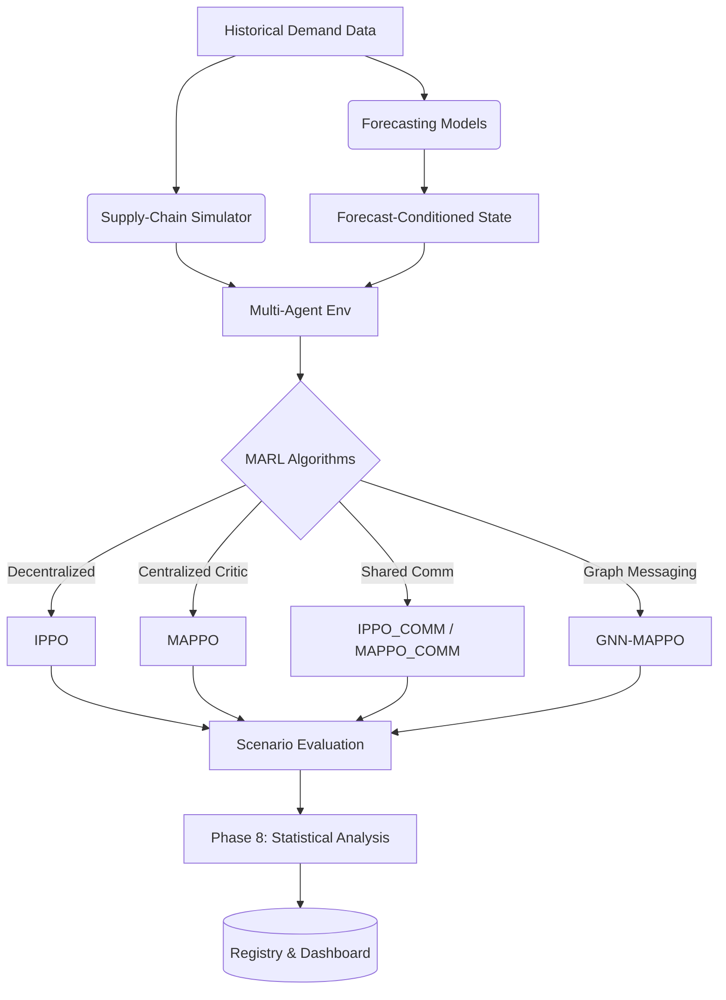

# Multi-Agent Reinforcement Learning for Supply-Chain Optimization

A comprehensive research framework for optimizing multi-echelon supply-chain policies under demand uncertainty using communication-aware Multi-Agent Reinforcement Learning (MARL) and time-series forecasting.

## Research Objective

Supply-chain networks inherently struggle with information asymmetry, compounding latency, and demand uncertainty—phenomena that trigger the bullwhip effect and catastrophic inventory imbalances. 
This project investigates the efficacy of decentralized and communication-augmented Multi-Agent Reinforcement Learning (MARL) algorithms to discover resilient replenishment policies. We explicitly evaluate:
- **Demand Uncertainty**: How baseline versus high-variance conditions affect policy convergence.
- **Distribution Shift**: The robustness of trained policies when exposed to out-of-distribution (OOD) scenarios such as demand spikes, capacity disruptions, and lead-time shifts.
- **Forecasting Integration**: Whether explicitly conditioning MARL actors on classical time-series forecasts improves resilience compared to raw temporal sequences.
- **Graph-Based Topologies**: The theoretical utility of Graph Neural Networks (GNN-MAPPO) for implicitly capturing supply-chain structures via node messaging.

## Research Architecture



## Supply-Chain Environment

A custom OpenAIGym/PettingZoo parallel simulator models a standard 4-echelon supply chain:
- **Agents**: Retailer, Wholesaler, Distributor, Manufacturer.
- **State Representation**: Local inventory levels, incoming orders, backlog, current pipeline pipeline (in-transit), and communication signals (if enabled).
- **Actions**: Continuous/discrete order quantities issued to upstream echelons.
- **Rewards**: Negative sum of holding costs and backlog penalties.
- **Evaluation Scenarios**: `in_distribution`, `demand_spike`, `demand_shift`, `capacity_disruption`, `lead_time_shift`, `combined_shift`.

## MARL Algorithms

| Method | Architecture | Parameter Sharing | Communication | Status |
|---|---|---|---|---|
| **IPPO** | Decentralized Actor/Critic | Shared per-echelon | None | ✅ Validated |
| **MAPPO** | Ind. Actor, Central Critic | Shared per-echelon | None | ✅ Validated |
| **IPPO_COMM** | Decentralized Actor/Critic | Shared per-echelon | Broadcast Vector | ✅ Validated |
| **MAPPO_COMM**| Ind. Actor, Central Critic | Shared per-echelon | Broadcast Vector | ✅ Validated |
| **GNN-MAPPO** | Graph Convolutional | Global | Node Messaging | 🟡 Implemented |

## Forecasting Pipeline

The environment includes extensible wrappers for demand prediction models. Standalone implementations evaluated include:
- Naive
- Moving Average
- Exponential Smoothing
- XGBoost
- LSTM

*Note: While standalone forecasting models have been implemented and benchmarked on historical datasets, full forecasting-conditioned MARL training (Phase 11) remains under experimental validation.*

## Experimental Design

The project employs rigorous experimental isolation:
- **Baseline vs. High Variance**: Agents are independently trained under standard demand and extreme variance conditions.
- **Robustness Matrix (Phase 6)**: 4 Algorithms × 2 Conditions × 5 Independent Training Seeds = 40 parallel training runs.
- **Evaluation Sweep (Phase 7)**: Every checkpoint is evaluated against 6 environmental scenarios using 5 distinct evaluation seeds, producing 1,200 evaluation artifacts.
- **Prevention of Pseudoreplication**: Experimental units are strictly grouped by the initial independent *Training Seed*. Repeated evaluation seeds are correctly aggregated rather than treated as independent N.

## Statistical Methodology

- **Experimental Unit**: Training seed ($N=5$).
- **Significance Testing**: Welch's independent t-test (assuming unequal variance).
- **Effect Size**: Cohen's $d$.
- **Multiple Comparisons**: Benjamini-Hochberg False Discovery Rate (FDR) correction to adjust raw $p$-values and prevent Type I error inflation.

## Results

### Simulator
- **Throughput**: ~30,642 steps/second on default CPU benchmarks.

### Model Inference
- **GNN-MAPPO Forward Pass**: ~0.0306 ms mean, ~0.0426 ms P99.

### Forecasting (Standalone)
- **XGBoost (Demand OOD Test)**: MAE: 1.2778, RMSE: 1.5667, sMAPE: 6.8933.

### MARL Experiments
- 40 independent checkpoints fully converged over 200 iterations.
- 1,200 OOD scenario evaluations completed successfully.

### Statistical Results
- Statistical testing verifies that MAPPO and MAPPO_COMM under baseline conditions yielded an adjusted p-value of 0.9413 (not statistically significant).
- IPPO vs. MAPPO yielded an adjusted p-value of 0.0674.

## Reproducibility

The repository ensures strict deterministic conditions:
- **Python Version**: 3.11.x
- **Dependency Management**: `requirements.txt` via `pip-tools`.
- **Random Seeds**: Globally seeded environment resets, Python `random`, `numpy.random`, and `torch.manual_seed`.
- **Provenance**: Training states export deterministic hashes into `manifest.json`, linked irreversibly to evaluation records and the global `models/registry.json`.

## Project Structure

```text
.
├── configs/             # YAML configurations for environments, models, sweeps
├── dashboard/           # Streamlit app for visualizing trajectories and stats
├── data/                # Reference datasets (e.g., historical demand)
├── envs/                # Supply-chain simulation and PettingZoo wrappers
├── forecasting/         # Time-series models and MARL observation wrappers
├── manifests/           # Infrastructure for checkpoint hashing and registry validation
├── models/              # Global experiment registry (registry.json)
├── results/             # Data artifacts (checkpoints, evaluations, stats)
├── rl/                  # Implementation of PPO, MAPPO, GNN algorithms
├── tests/               # PyTest suite for structural logic and regression prevention
├── tools/               # Hard evidence collection and reproducibility harnesses
└── requirements.txt     # Locked project dependencies
```

## Installation

```bash
# Initialize virtual environment
python -m venv .venv

# Activate the virtual environment (Windows)
.venv\Scripts\activate

# Install dependencies
pip install -r requirements.txt
```

## Running the Project

All commands execute from the project root.

- **Run Automated Tests**: 
  `python -m pytest`
- **Train MAPPO/IPPO Matrix (Phase 6)**: 
  `python run_phase6_matrix.py`
- **Run OOD Evaluations (Phase 7)**: 
  `python run_phase7.py`
- **Perform Statistical Analysis (Phase 8)**: 
  `python run_phase8_analysis.py`
- **Launch Visualization Dashboard**: 
  `streamlit run dashboard/app.py`
- **Generate Forensic Evidence Suite**: 
  `python tools/evidence/run_all_evidence.py`

## Testing
- **Status**: 148 / 148 automated tests passed successfully.
- **Coverage**: Evaluates simulator logic, deterministic seeds, matrix shapes, pipeline integration, and prevention of gradient leakage.

## Benchmarking
Hardware profiling metrics are derived from the executable test harness (`tools/evidence/benchmark_performance.py`), running under isolated processes via `time.perf_counter`. (Results listed above under the Results section were profiled on an Intel CPU with PyTorch CPU constraints).

## Research Roadmap

- ✅ **Phase 0** — Reproducibility foundation
- ✅ **Phase 1** — Supply-chain simulator
- ✅ **Phase 2** — Multi-agent environment
- ✅ **Phase 3** — Out-of-distribution / distribution-shift scenarios
- ✅ **Phase 4** — IPPO/MAPPO training pipelines
- ✅ **Phase 5** — Pilot/validation execution
- ✅ **Phase 6** — Robustness matrix (40 configurations)
- ✅ **Phase 7** — Held-out/distribution-shift evaluation
- ✅ **Phase 8** — Statistical analysis
- ✅ **Phase 9** — Demand forecasting benchmarking
- 🟡 **Phase 10** — GNN-MAPPO (Implemented / Validation Pending)
- 🟡 **Phase 11** — Forecasting + GNN-MAPPO (Implemented / Validation Pending)
- 🔵 **Phase 12** — Comprehensive ablations/statistics
- ✅ **Phase 13** — Experiment registry/reproducibility
- ✅ **Phase 14** — Research dashboard

## Current Limitations

1. **Hash Provenance Discrepancy**: The codebase employs conflicting hash methodologies. `rl/checkpoint.py` creates a "content hash" by evaluating PyTorch tensor arrays in memory, while the evidence harness calculates standard physical `.pt` file hashes (which include zip metadata). Because these mechanisms differ, automated verification currently reports 100% hash mismatches, though the checkpoints themselves remain architecturally intact and uncorrupted.
2. **Computational Scale**: Experiments are constrained to single-node CPU parallelism; wide-scale multi-GPU hyperparameter sweeps are not yet executed.
3. **Graph-based MARL Validation**: While the GNN-MAPPO agent logic and local observation graph builders exist, extensive parallel convergence testing is strictly marked as pending.
4. **Integration**: Full integration of accurate forecasting logic directly into real-time MARL state transitions has been wrapped but not statistically validated against baselines.

## Research Integrity

This project maintains strict evidence-based documentation:
- Reported results correspond exclusively to directly executed and reproducible experimental code.
- Incomplete experiments (e.g., Phase 10/11) are explicitly delineated and not falsely reported as complete.
- Experimental units properly aggregate repeated evaluation seeds to prevent pseudoreplication masking as statistical significance.
- Non-significant or negative results (e.g., MAPPO vs MAPPO_COMM baseline performance) are retained and reported truthfully.

## Future Work

- **GNN-MAPPO Pipeline Integration**: Execute Phase 10 matrices to determine if dynamic topology awareness improves resilience.
- **Forecasting Integration (Phase 11)**: Test XGBoost-conditioned environment wrappers and measure step-latency trade-offs during RL optimization.
- **Registry Hardening**: Harmonize `_hash_state_dict` content hashing with the registry's block-file hashing mechanisms.

## License

This project is licensed under the MIT License. See the `LICENSE` file for details.
